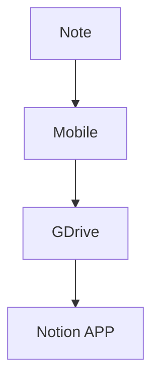

# ink2Notes

ink2Notes est une application permettant d'extraire des images de pages de carnets de notes papier stockées sur Google Drive, de les analyser, puis de créer des pages sur Notion basées sur le contenu extrait. Ce projet utilise les APIs de Google Drive, OpenAI et Notion.



## Prérequis

Avant de commencer, assurez-vous d'avoir les éléments suivants :

1. Python 3.12 installé.
2. `pip` pour installer les dépendances Python.
3. Les fichiers d'authentification pour les services Google et Notion :
   - `credentials.json` pour l'authentification Google.
   - Une clé d'API Notion pour établir la connexion avec Notion.
4. Un compte OpenAI et une clé d'API correspondante pour accéder à l'API GPT-4o.

## Installation

1. Clonez ce dépôt sur votre machine locale :

   ```bash
   git clone https://github.com/votre-compte/ink2Notes.git
   cd ink2Notes
   ```

2. Créez un environnement virtuel et activez-le :

   ```bash
   python -m venv venv
   source venv/bin/activate  # Sur Windows : venv\Scripts\activate
   ```

3. Installez les dépendances :

   ```bash
   pip install -r requirements.txt
   ```

4. Placez les fichiers `credentials.json` et `token.json` dans le dossier racine `ink2Notes/`.

## Configuration

Modifiez les variables d'environnement ou le fichier de configuration avec vos clés d'API respectives :

- `GOOGLE_CREDS`: Chemin d'accès au fichier `credentials.json` pour Google API.
- `GOOGLE_TOKEN`: Chemin d'accès au fichier `token.json`.
- Clé API OpenAI et Notion.

Ces informations peuvent être placées dans un fichier `.env`.

## Utilisation

Pour lancer le script principal, naviguez dans le répertoire racine du projet et exécutez la commande suivante :

```bash
python -m ink2Notes.orchestrator
```

Ce script :

1. Récupère les images de pages de carnets de notes papier depuis un dossier précis de Google Drive.
2. Utilise OpenAI pour analyser le contenu des images et extraire le texte.
3. Crée des pages dans Notion avec le contenu extrait.

## Tests

Les tests unitaires sont développés en utilisant `pytest`. Pour exécuter les tests :

```bash
pytest -s tests/
```

Cela inclut des tests sur les fonctions principales comme `get_google_credentials`, `list_drive_files`, et `download_image`. Vous pouvez également utiliser VS Code pour exécuter des tests individuels.

## Organisation du code

- **ink2Notes/drive\_connector.py** : Gère l'authentification avec Google, la liste des fichiers, et les téléchargements depuis Google Drive.
- **ink2Notes/orchestrator.py** : Orchestre l'ensemble du processus, de l'extraction à la création de contenu sur Notion.
- **ink2Notes/openai\_connector.py** : Interface avec l'API OpenAI pour analyser le contenu des images.
- **ink2Notes/notion\_connector.py** : Interface avec l'API Notion pour créer des pages à partir du contenu extrait.
- **ink2Notes/utils.py** : Contient des fonctions utilitaires, y compris le logger et les chemins de fichiers de configuration.
- **tests/** : Contient les tests unitaires du projet.

## Problèmes courants

1. **ModuleNotFoundError :** Assurez-vous d'exécuter le script dans le répertoire racine du projet et d'activer l'environnement virtuel.
2. **Erreur d'authentification Google :** Vérifiez que `credentials.json` et `token.json` sont bien en place et valides.

## Contribution

Les contributions sont les bienvenues ! Créez une branche, faites vos modifications, et soumettez une Pull Request.

## Licence

Ce projet est sous licence **Creative Commons Attribution-NonCommercial (CC BY-NC)**. Cela signifie que vous pouvez utiliser, partager et adapter ce projet tant que c'est à des fins non commerciales, et que vous attribuez le crédit approprié. Pour toute utilisation commerciale, une autorisation est requise.

